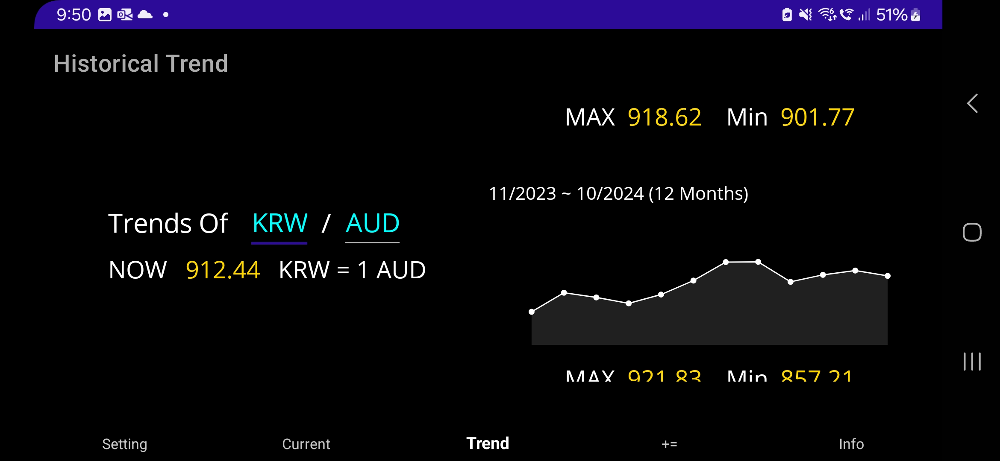

# Au-Currency
Mobile Currency Application Development with Maui (Assessment Result in Tafe Cert 4)
  

## Before Using It
- You need to update your API Key in "APIService.cs" in "Services" directory.
- Please cancel and rebuild when opening the application and the screen is frozen more than one minute.
  

## Examples of Applcation Pages
### 1. Setting Page

 

 

### 2. Current Trend Page

 

 

### 3. Historical Trend Page

### 4. Info Page

